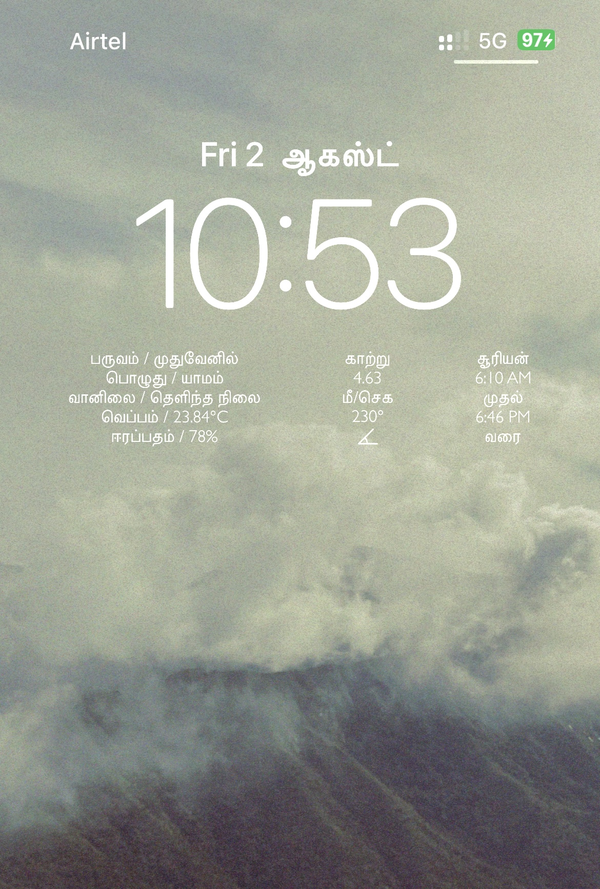

### Tamil weather widgets (ios)

These are ios lock screen widgets, you can use it as normal widget also.

#### Variables to configure

You need to put value for `openweather_api_key` variable in weather, wind, sun widgets.

You can create one from here https://openweathermap.org/api

#### To customize

Since these are lock screen widgets, you can change color of these widgets , like how you change clock color.

In widget scripts you can change `font_size` , based on your screen size if it is not suitable.

